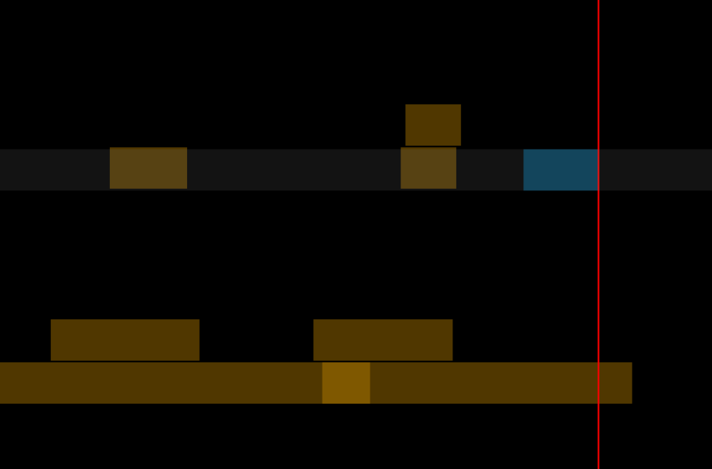

Canvas
======

Canvas is a minimalistic music recording tool. Instead of tracks it
uses clips. You can point anywhere on the screen and press
record. This allows you to very quickly build up a song layer by
layer.

Project Status
--------------

The program is fully usable but has not been properly polished for
release. I have no plans to develop it any further as I've moved on to
an even more minimalistic program.

Canvas requires Python 3, pyudio and Gtk/Cairo.

I am not aware of any bugs.

Overview
--------

The screenshot shows an example recording with 8 clips. The blue clip
is currently being recorded. It's blue to indicated that it is
selected. You can delete selected clips.

The red line is the cursor. It is red when recording and white when not.

Clips are locked in time but can be moved up and down to keep things
organized. This is purely visual and has no effect on the sound.

Clips are drawn slightly transparent so you can see when they overlap,
as you can see in the bottom two clips. In this case I've recorded a
bass line and then gone back later to extend it.

The display will always show the whole recording. The program will
expand to fill the whole screen but you can resize the window.

All changes are saved immediately.

When you close the window a mixdown of the whole recording will be
written to ``mix.wav`` in the project folder.

Project Files
-------------

When you start Canvas without any arguments it will create a project
folder on your desktop. You can instead specify a folder on the
command line::

    canvas mysong

This will open a canvas and create a project directory. The file layout is::

    mysong/clips/*.wav   # A WAV file for each clip.
    mysong/clips.json    # Metadata about clips.
    mysong/mix.wav       # A mixdown which is create when you quit the program.

Controls
--------

* Click on a clip to select it. You can hold shift to select more clips.

* Click and drag to move a clip up or down.

* Click and drag on the background to move cursor.

* Arrow keys: Move cursor (up/down/forward/backward).

* Enter: Record a new clip starting at the current cursor position.

* Space Bar: Toggle play / stop.

* Delete / Backspace: delete selected clips.

* s (hold down): Solo selected clips.

* m: Mute / unmute selected clips.

Author
======

Ole Martin Bjørndalen - ombdalen@gmail.com
